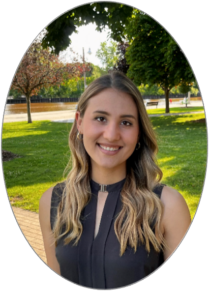

<div style="clear: both;"></div>
 <p> </p>
 <p> </p>
 
<div style="float: left; width: 42%; margin-left: 8%">
  
</div>
<div style="float: left; width: 47%;font-size: 18px; margin-left: 3%; color: #529E56; text-align: center;">
  <p> </p>
  <p> *"What you do makes a difference, and you have to decide what kind of difference you want to make."  - Dr. Jane Goodall* </p>
  <p> </p>
</div>
<div style="float: left; width: 46%;font-size: 19px; margin-left: 4%">
  <p>Born and raised in Southern Ontario, I spent a lot of my childhood marveling at the biodiversity in and around the Great Lakes region. I've always had a deep love for nature and a passion to protect it.</p>
  <p> </p>
  <p> That passion has driven me to dedicate both my professional and personal life to wildlife conservation and sustainable living. My professional history (so far) reflects this as I've had the privileged to work with and be supervised by excellent conservation biologists and ecologists. </p>
  <p> In my personal life, I try to live sustainable by eating a flexitarian diet, reducing my air travel, supporting local small businesses, diverting waste from landfills, and minimizing use of AI. </p>
  <p> </p>
  <p> </p>
  </div>
<div style="clear: both;"></div>
 <p> </p>
 <p> </p>
 <p> </p>
 <p> </p>

<div style="float: center; width: 80%;font-size: 16px; margin-left: 10%">
  <p> </p>
  <p> </p>
  <p> </p>
  <p> </p>
  <p> </p>
  <p> </p>
  <p> </p>
  <p> </p>
  <p> </p>
  <p> </p>
  <p> </p>
  <p> </p>
  <p> </p>
  <p> </p>
  <p> </p>
  <p> </p>
  <p> </p>
  <p> </p>
  <p> <u>*Professional history*</u> </p>
  <p> I earned a BSc in Biology at McMaster University where I did my undergraduate thesis project under the supervision of Prof. Rosa da Silva (Class of 2018). </p>
  <p> I then earned my MSc in Conservation Biology at the University of Alberta under the supervision of Prof. Stephanie Green (Class of 2021) before working as a public servant with the Canadian Wildlife Service - Ontario of Environment and Climate Change Canada (2022-2024). I then returned to academia to pursue my PhD in invasion biology with Prof. Anthony Ricciardi (graduation anticipated 2028). </p>
  <p> After earning my doctorate, I aspire to rejoin the GoC as a BI-03 that works on invasive species management. I also consider pursuing a tenured-track position and leading my own research group.</p>
  <p> </p>
</div>
```{r, echo=FALSE,out.width="80%",out.height="100%",fig.cap=" ",fig.show='hold',fig.align='center' }
knitr::include_graphics(c("WebsiteImages/AcademicLineage.png"))
```
<div style="float: center; width: 100%;font-size: 10px; margin-left: 10%">
  <p> My professional history to date.</p>
  <p> </p>
</div>
<div style="clear: both;"></div>
 <p> </p>
 <p> </p>

<div style="clear: both;"></div>
 <p> </p>
 <p> </p>
 <p> </p>
  <p> </p>
<div style="float: center; width: 80%;font-size: 16px; margin-left: 10%">
  <p> </p>
  <p> <u>*Fun facts about me*</u> </p>
  <p> * Favorite work-related activity: Coding (R is my preferred language)
 * Personal hero: Dr. Jane Goodall
 * Favorite recreational activities: Hiking, fiber arts, baking, & spending time with family & friends
 * Something I try to practice everyday: Sustainable living & gratitude 
 * Area of study, if not ecology: Ancient greek mythology</p>
  <p> </p>
</div>


